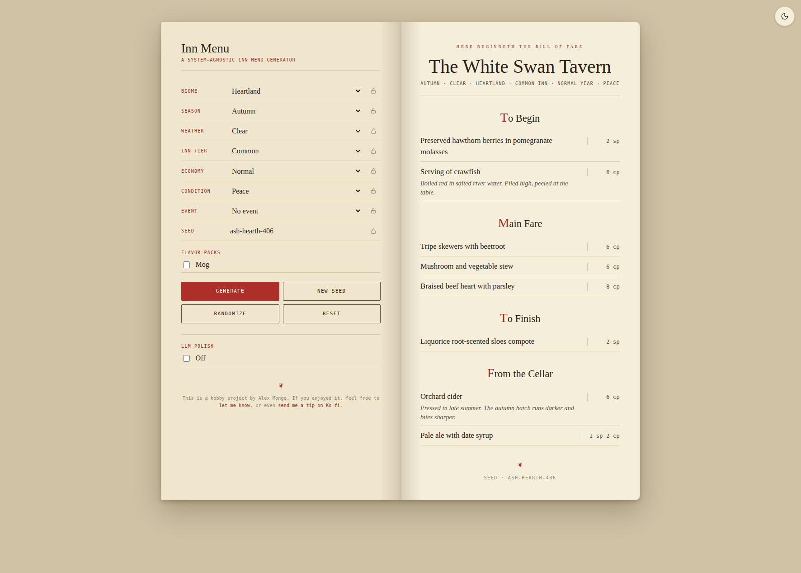
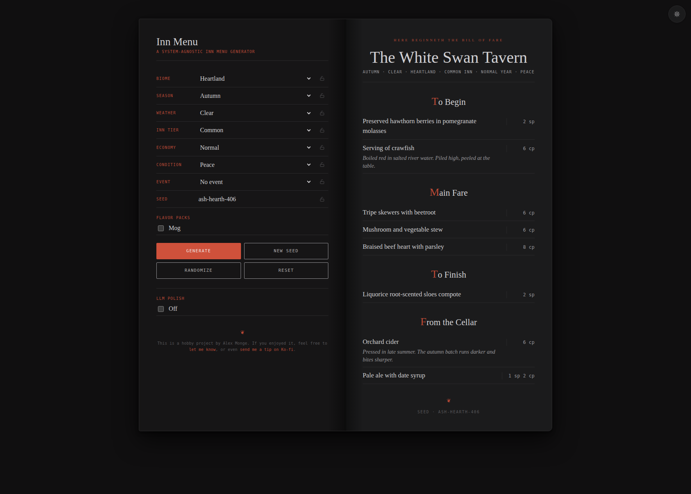

# Inn Menu Simulator

A system-agnostic fantasy RPG inn menu generator. Feed it a biome, a season, some weather, an inn tier, and an event or two: get back a plausible menu with D&D-style copper/silver/gold prices.

Data-first: the generator is a thin layer over JSON data files. Anyone can fork it, edit ingredients and dishes, and have their own regional cuisine in an afternoon.

<p align="center">
  
  
</p>

## Quick start

Open `index.html` in a browser. That is the whole thing.

To host it live via GitHub Pages, see `docs/SETUP.md`. Hosted repos also get an auto-deployed preview of every branch at `/previews/<branch>/`, with an index at `/previews/`.

## How it works

1. You set world parameters: biome, season, weather, inn tier, economy, condition (war, plague, etc.), optional event.
2. The generator filters an **authored pool** of ~250 hand-written dishes by those tags (no citrus at a sieged mountain inn; no aurochs ribs at a roadside ale-house).
3. It draws dishes using weighted random: native biome beats "any" beats import. Seasonal matches get boosted. Exotic trade goods appear only at fine/noble inns and never during war, plague, isolation, or siege.
4. Each slot is routed to the procedural engine a set fraction of the time (about a third, set by `authored_ratio`), which assembles a dish from ingredients + preparations. It also serves as the fallback when the authored pool can't fill a slot.
5. Prices compute from `cost × tier × economy × condition × event × import` (regional ×1.3, distant ×1.7), rendered in cp/sp/gp.
6. Any menu can be shared: the Share link action builds a URL carrying every dial and the seed (opening one restores that exact menu), Copy text puts a plain-text version on the clipboard for session notes, and Print PDF prints just the menu page.
7. Optional "Polish with LLM" code exists (`src/llm.js`) but the control is currently hidden on the site; menus are generated by deterministic rules, no AI involved. Re-enable by removing the `hidden` attribute on the polish block in `index.html`.

## Flavor packs

The default content pool is system-agnostic: generic medieval-fantasy fare that should fit most settings. **Flavor packs** are optional opt-in overlays that add setting-specific named dishes (e.g. "Stokvis Bay cod" instead of "cod") on top of the generic pool. Each pack is a single JSON file under `data/flavor_packs/`, listed in `data/flavor_packs/index.json`. Toggle them on or off with the checkboxes under the Seed field, all default off.

The repo ships with two visible packs, both off by default. **OSR Bestiary** adds huntable-monster fare (hippogriff steak, slime soup, owlbear rashers, mastodon pot roast) with a creature roster drawn from [Clay Davis' OSR Bestiary](https://clayadavis.gitlab.io/osr-bestiary/), itself built on the [Basic Fantasy RPG](https://www.basicfantasy.org/); it leans beastly rather than sentient, with no undead and nothing obviously venomous on the plate. **Mog** is the author's campaign setting; check it to add Mog's regional cuisine. Forks can drop their own packs into `data/flavor_packs/` and add an entry to `index.json`: no code changes required. See `docs/DESIGN.md` for the pack schema.

## Historical mode

An opt-in **Historical** checkbox (next to the flavor packs) biases generation toward what a kitchen in roughly 14th-16th century Europe could plausibly serve: New World foods and distilled spirits drop out, fish days arrive probabilistically (meat off the board, and eggs and dairy too on the strict days), dish counts tighten per the 1363 sumptuary statutes, bread and ale hold near-assize prices, and period items the sources insisted on (verjuice, stockfish, pottages, mortrews, wafers) join the pool. A modal on the page explains exactly what changes and what the mode does not claim. It exists because food historians on Reddit audited the generator's assumptions; fantasy mode is completely unchanged when the box is off. Details in `docs/DESIGN.md`.

## Project layout

```
inn-menu-simulator/
├── index.html                  # the app
├── robots.txt                  # keeps /previews/ out of search engines
├── .github/
│   └── workflows/
│       └── deploy-pages.yml    # Pages deploy: main + branch previews
├── src/
│   ├── generator.js            # authored-first generation logic
│   ├── innname.js              # sign-based inn/tavern name generator
│   ├── ui.js                   # form wiring + rendering + pack merging
│   └── llm.js                  # optional flavor polish
├── data/
│   ├── authored_dishes.json    # hand-written generic dishes (primary pool)
│   ├── ingredients.json        # for procedural fallback and drinks
│   ├── preparations.json       # stew, roast, grill, etc.
│   ├── dishes.json             # procedural templates (fallback only)
│   ├── modifiers.json          # biomes, tiers, economy, conditions, weather
│   ├── events.json             # transient events
│   ├── inn_names.json          # charges, colors, patterns for inn names
│   └── flavor_packs/           # optional setting-specific overlays
│       ├── index.json          # manifest of available packs
│       ├── historical.json     # period layer for Historical mode (hidden)
│       ├── osr-bestiary.json   # huntable-monster fare (off by default)
│       └── mog.json            # the Mog setting pack (off by default)
├── scripts/
│   ├── smoke.js                # regression frequency sweep (npm run smoke)
│   ├── smoke-deep.js           # editorial per-axis audit
│   ├── balance-probe.js        # focused import-frequency probe
│   ├── import-label-check.js   # before/after probe for procedural import labels
│   ├── historical-coverage.js  # read-only: per-biome pool removal under Historical mode
│   ├── tag-origins.js          # one-shot data sweep: tag ingredient origins
│   ├── build-preview-site.mjs  # composes the Pages site (run by CI)
│   └── lib/
│       ├── loader.js           # shared Node bootstrap for the browser modules
│       └── checks.js           # shared structural-check helpers
├── out/
│   ├── smoke-report.md         # latest regression report (regenerated)
│   └── smoke-deep.md           # latest editorial audit (regenerated)
├── docs/
│   ├── DESIGN.md               # architecture, tag taxonomy, decision log
│   ├── SETUP.md                # GitHub + Pages walkthrough
│   ├── ARID_SOURCES.md         # provenance for the arid dish pack
│   ├── ARID_NAMING.md          # arid establishment-naming design notes
│   └── screenshot-*.png        # README miniatures (light/dark)
├── package.json
├── LICENSE
└── README.md
```

## Smoke testing the corpus

Two Node-only scripts cover regression and curation. `npm run smoke` runs the regression check; `node scripts/smoke-deep.js` runs the editorial audit. See `docs/DESIGN.md` for the full reference.

`npm run smoke` sweeps the Cartesian product of biome × season × weather × tier × economy × condition × event (skipping incompatible combos), generates several menus per world with distinct seeds, and writes a frequency report to `out/smoke-report.md`. The report flags authored dishes, ingredients, preparations, and templates that appear too often, too rarely, or never. Useful after editing JSON data to catch dishes that became unreachable, ingredients that no template can pull, or preparations that the weather bias is crowding out. Tune sample size with `SAMPLES=N npm run smoke` (default 5) or cap worlds with `WORLDS=N` for a quick check.

`node scripts/smoke-deep.js` does the same sweep but reports per-axis (per biome, season, tier, condition, weather, event) top-5 ingredients and dishes, plus structural scans for invalid biome IDs, unreachable ingredients, sparse (biome × season × section) cells, and other data-shape issues. Output goes to `out/smoke-deep.md`. Run before an editorial pass to find what to write next and which existing entries have bugs.

## Contributing

The data files are the actual content. If you want to add ingredients, dishes, or events, edit the JSON. Schema is documented in `docs/DESIGN.md`. For setting-specific contributions (named regional dishes, proper-noun ingredients), add a flavor pack instead of touching the generic pool: see the Flavor packs section above.

Code is MIT licensed. Data files are CC-BY-SA 4.0: fork and remix freely, credit appreciated.

## Acknowledgments

Jim Chevallier, food historian, and u/iuabv of r/AskFoodHistorians audited the generator's assumptions about what a medieval inn actually served; their sources and corrections shaped the Historical mode's price model, fish days, and larder. Errors that remain are this project's, not theirs.

u/Mephos of r/rpg_generators test-drove the interface; their notes produced the share links, the world summary matching the form's order, and the how-it-works explainer.
